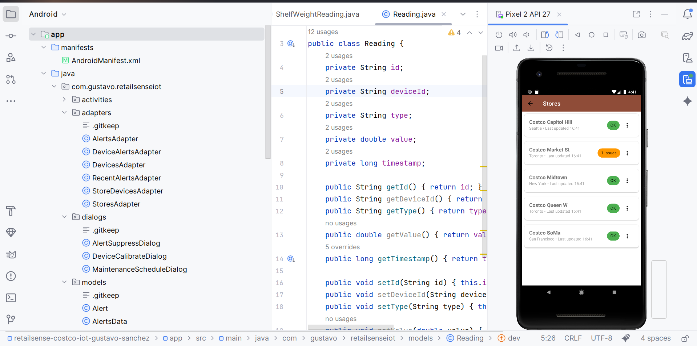
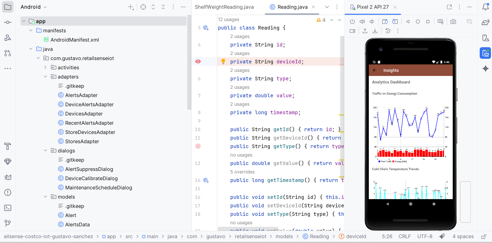

# RetailSense IoT - Costco Store Management App

## Overview
Offline Android application for managing Costco store IoT devices using Material Design 3. Provides comprehensive dashboard for store leaders to monitor devices, handle alerts, and schedule maintenance.

## Features
- **Store Management**: View and manage multiple Costco locations
- **Device Monitoring**: Real-time device status and historical data
- **Alert System**: Filter, acknowledge, and suppress alerts
- **Analytics Dashboard**: 4 analytical charts for business insights
- **Maintenance Scheduling**: Schedule and track device maintenance

## Technical Specifications
- **Platform**: Android (Java)
- **Min SDK**: 27 (Android 8.1)
- **Target SDK**: 34 (Android 14)
- **Architecture**: MVVM with ViewBinding
- **Design**: Material Design 3
- **Data**: Local JSON/CSV files (offline)
- **Charts**: MPAndroidChart library

## Screenshots





## Build Instructions

### Prerequisites
- Android Studio Giraffe or newer
- Android SDK 24+
- Java 8+

### Setup Steps
1. Clone repository:
   ```
   git clone https://github.com/SiDeRaL12/retailsense-costco-iot-gustavo-sanchez.git
   cd retailsense-costco-iot-gustavo-sanchez
   ```

2. Open in Android Studio:
   - File → Open → Select project directory
   - Wait for Gradle sync to complete

3. Build and run:
   - Connect Android device or start emulator
   - Click Run button or use `Shift + F10`

### Project Structure
```
app/src/main/
├── java/com/gustavo/retailsenseiot/
│   ├── activities/          # All activity classes
│   ├── adapters/           # RecyclerView adapters  
│   ├── models/             # Data model classes
│   ├── utils/              # Utility classes (DataManager, CSVLoader)
│   └── dialogs/            # Dialog implementations
├── res/
│   ├── layout/             # Activity and dialog layouts
│   ├── values/             # Colors, strings, themes
│   ├── drawable/           # Icons and graphics
│   └── menu/               # Menu definitions
└── assets/                 # JSON and CSV data files
    ├── stores.json
    ├── devices.json  
    ├── alerts.json
    └── readings_*.csv      # Device reading data
```

## Navigation Flow
1. **Home** → Choose module (Stores/Devices/Alerts/Insights)
2. **Stores** → Select store → **Store Dashboard** → View KPIs and manage
3. **Devices** → Filter devices → **Device Detail** → View data and calibrate
4. **Alerts** → Filter and manage → Navigate to related devices
5. **Insights** → View analytical charts and correlations

## Key Features Implementation

### Material Design 3 Integration
- Complete MD3 theme with dynamic colors
- Material components throughout (Cards, Chips, Buttons)
- Consistent typography and spacing
- Dark mode support

### Data Management
- Offline-first architecture with local JSON/CSV
- DataManager singleton for centralized data access
- Graceful handling of malformed CSV data
- Real-time data filtering and sorting

### Performance Optimizations
- RecyclerView filtering under 100ms (V1 requirement)
- Efficient chart rendering with MPAndroidChart
- Lazy loading of device readings
- Optimized adapter implementations

### Dialog System
- Material 3 styled dialogs with proper validation
- Maintenance scheduling with date/time constraints
- Alert suppression with duration options
- Device calibration with type-specific validation

## Testing
Run the acceptance test checklist in `CHECKS.md` to verify all requirements.

## Contributing
This project is for academic purposes (MAP524 course). 

## License
MIT License - See LICENSE file

## Contact
**Developer**: Gustavo Sanchez  
**Course**: MAP524 - Mobile App Development
**Institution**: Seneca College
